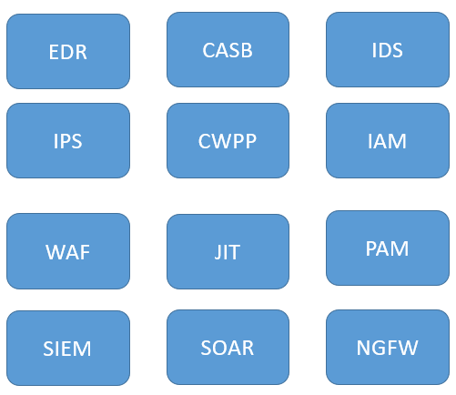
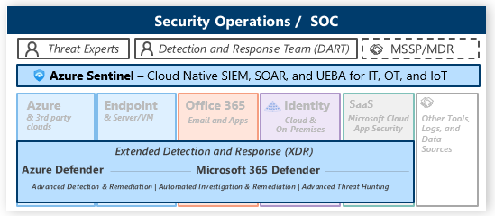

# What is a SIEM?
Azure Sentinel is a Security information and event management (SIEM). A SIEM system combines outputs from multiple sources and uses alarm filtering techniques to distinguish malicious activity from false alarms.

A lot of security seolutions exist which cater to specific needs of an organiation. A SIEM sits at the centre itegrating and collecting data from all these solutions.

### The Microsoft Security Stack for Security Operations Center
 

### Where does Azure Security Center fit into this
Azure Security Center was originally designed to be a Cloud Workload Posture Protection(CWPP) service which can help protect all infrastructure in Azure and other major clouds.

Azure Security Center also includes Azure Defender which is the EDR/XDR solution for Cloud and selected on-prem workloads. More details can be found [here](https://docs.microsoft.com/en-us/azure/security-center/security-center-introduction).

### What is Azure Sentinel?
Azure Sentinel is Microsoft's cloud native SIEM(Security Information and Event Management) + SOAR(Security Ochestration and Response) and has the capability to monitor and remediate several workloads in Azure, Other Clouds as well as On-Premises. 

[More Details](https://docs.microsoft.com/en-us/azure/sentinel/overview)

#### | [home](./welcome.md)

